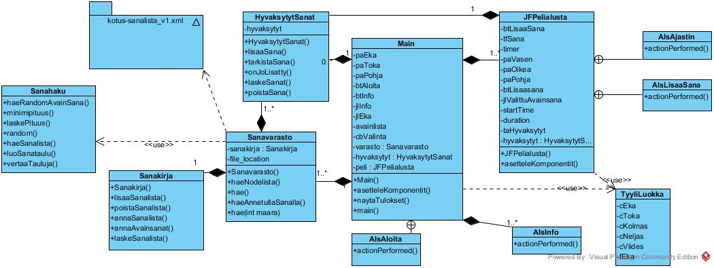
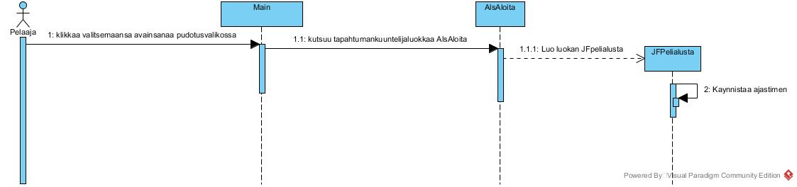
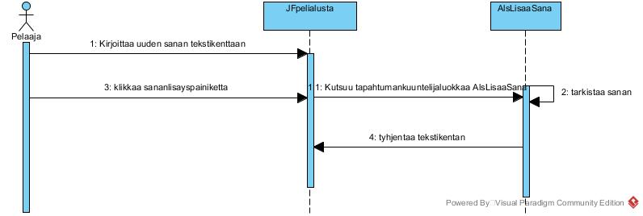

#Aiheen kuvaus ja rakenne

##Aihe

*Harjoitustyön aiheena on yksinkertainen sanapeli nimeltä sanasta sanaan. Siinä pitemmän alkusanan kirjaimista muodostetaan mahdollisimman monta perusmuodossa olevaa suomenkielistä sanaa. Erisnimet ja yhdyssanat eivät ole sallittuja. Pisteitä saa 1/sana.*

##Käyttäjät
####Pelaaja
- Klikkaa peliohjeen auki info-painikkeesta
- Valitsee valikosta sanan klikkaamalla, jolloin aika alkaa juosta
- Syöttää sanat avautuvaan valikkoon, submittaa klikkaamalla joka sanan
- Katsoo tuloksensa pisteruudusta, kun aika loppuu

####Admin
- lisää/muokkaa/poistaa alkusanoja sanatiedostoja

##Käyttöliittymä
*Pelin graafinen käyttöliittymä toteutetaan java swingillä.*

##Luokkakaavio

##Sekvenssikaaviot
####Peliohjeen lukeminen

####Avainsanan valinta

####Epäonnistunut sanan lisäys

